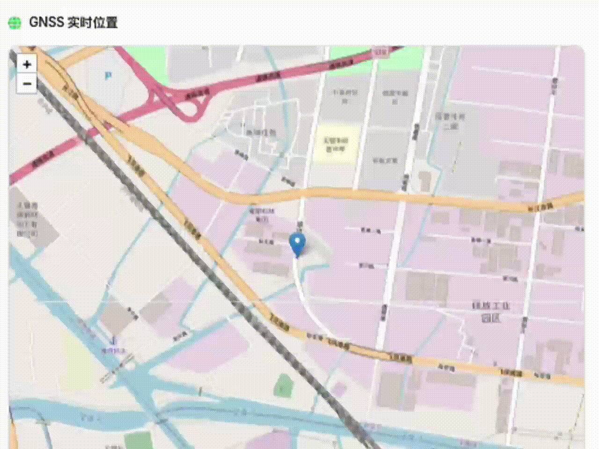

<p align="center">
  
</p>
<h1 align="center">TasFusion</h1>
<p align="center">
GNSS / IMU Sliding-Window Optimization Framework
</p>

<div align="center">
<table>
  <thead>
    <tr>
      <th align="center">Author Name</th>
      <th align="center">Affiliation</th>
      <th align="center">Contact Email</th>
    </tr>
  </thead>
  <tbody>
    <tr>
      <td align="center">Gao Yixin</td>
      <td align="center">HK PolyU TAS LAB</td>
      <td align="center">yixin.gao@connect.polyu.hk</td>
    </tr>
    <tr>
      <td align="center">Wang Xiangru</td>
      <td align="center">HK PolyU TAS LAB</td>
      <td align="center">xiangru.wang@polyu.edu.hk</td>
    </tr>
    <tr>
      <td align="center">ZHAO Jiaqi</td>
      <td align="center">HK PolyU TAS LAB</td>
      <td align="center">jiaqi.zhao@connect.polyu.hk</td>
    </tr>
  </tbody>
</table>
</div>

<p align="center">
  <a href="https://polyu-taslab.github.io/">
    <strong>PolyU TASLab</strong>
  </a><br/>
  https://polyu-taslab.github.io/
</p>

## Overview

TasFusion is a ROS1 package designed for multi-sensor navigation. Its core functionality provides a Ceres-based GNSS/IMU loosely coupled sliding-window optimization framework, along with supporting tools including GNSS message definitions, NLOS exclusion utilities, a NovAtel driver, and NMEA ROS parsing scripts.

The central sensor-fusion node supports IMU pre-integration, online bias estimation, marginalization to preserve historical information, and GPS position/velocity constraints. All major functions can be flexibly enabled or disabled through parameters configured in launch files.

## Key Features

* **Sliding-Window Nonlinear Optimization with Marginalization**

  TasFusion implements a GNSS/IMU loosely coupled sliding-window optimization framework based on  **Ceres Solver** ,  **Eigen** , and core **ROS** libraries. The central node `gnss_imu_sw_node` performs nonlinear least-squares optimization within a fixed-size window, while marginalization is applied to retain historical information and maintain computational efficiency.
* **Highly Configurable Sensor Inputs and Fusion Strategy**

  Launch files provide flexible configuration of IMU, GNSS, and ground-truth topics and message types. The system supports GPS-based position, velocity, and attitude initialization, and allows users to enable or disable online bias estimation, marginalization, and velocity/attitude constraint weighting via parameters, facilitating ablation studies and algorithm evaluation.
* **Logging and Visualization Support**

  RViz-based trajectory visualization is enabled by default. The system can also export GNSS measurements, ground truth, optimized states, performance metrics, and IMU biases to CSV files for offline post-processing, benchmarking, and result reproduction.
* **Auxiliary Scripts and Toolchain**

  A set of Python utilities is provided, including rosbag topic frequency analysis and bias visualization tools, enabling rapid assessment of sensor data quality and system behavior.
* **Support for Multiple GNSS Message Types**

  The fusion node supports multiple GNSS data formats, selectable via the `gnss_message_type` parameter:

  * `novatel_msgs/INSPVAX`
  * `gnss_comm/GnssPVTSolnMsg`
  * `nav_msgs/Odometry`

  This design allows seamless integration with different GNSS receivers and data pipelines.

## Repository Structure

* **`tasfusion/`**

  Core GNSS/IMU sensor fusion package, including the sliding-window optimization node, RViz configurations, and launch files. This module is responsible for nonlinear optimization, state estimation, and data logging.
* **`nlosexclusion/`**

  GNSS NLOS (Non-Line-of-Sight) exclusion module, providing message definitions and implementation for NLOS detection and mitigation.
* **[`novatel_span_driver/`](https://github.com/ros-drivers/novatel_span_driver.git)**

  ROS driver for interfacing with NovAtel SPAN GNSS/INS receivers.
* **[`gnss_comm/`](https://github.com/HKUST-Aerial-Robotics/gnss_comm.git)**

  A GNSS utility library providing raw GNSS measurement definitions and processing tools, along with dependency documentation and Docker support.
* **`nmea_parser/`**

  NMEA parsing package built on top of `gnss_comm`, enabling standardized GNSS message decoding and conversion.
* **`helper_scripts/`**

  A collection of scripts for data analysis, visualization, and performance evaluation.
* **`support_files/`**

  Supplementary materials including a tasfusion tutorial PDF and archived dependency packages for Ceres Solver and Eigen.
* **`data/rosbag/demo_rosbag.zip`**

  Built-in demo rosbag for quick testing and playback.
* **`data/results/`**

  Directory for storing output results, logs, and exported CSV files.

## Enviroment & Dependencies

- This package is developed under Ubuntu20.04 LTSC [ROS Noetic](https://wiki.ros.org/noetic/Installation/Ubuntu) environment.
- Use [Eigen 3.3.4](https://gitlab.com/libeigen/eigen/-/archive/3.3.4/eigen-3.3.4.zip) for matrix manipulation.
  ```
  cd eigen-3.3.4/
  mkdir build
  cd build
  cmake ..
  sudo make install
  ```
- Use [Ceres 2.1.0 ](https://github.com/ceres-solver/ceres-solver/archive/refs/tags/2.1.0.zip)for optimize.
  ```
  cd Ceres-2.1.0
  mkdir build
  cd build
  cmake ..
  make -j4
  sudo make install
  ```
- Use google's glog library for message output
  ```bash
  sudo apt-get install libgoogle-glog-dev
  ```

## Build Instructions

1. **Create a workspace and clone the repository
   (Assuming the workspace path is `~/tasfusion_ws/src`):**

   ```bash
   mkdir ~/tasfusion_ws/src
   cd ~/tasfusion_ws/src
   git clone https://github.com/Qiamp/TasFusion.git
   ```
2. **Build the workspace and source the environment** :

   ```bash
   cd ~/catkin_ws
   catkin_make
   source devel/setup.bash
   ```

## Quick Start

1. **Extract the demo dataset** :
   `unzip data/rosbag/demo_rosbag.zip -d data/rosbag`。
2. **Launch the fusion node and visualization**
   (RViz is enabled by default):

   ```bash
   roslaunch tasfusion batch_board.launch
   ```

   The launch file allows users to configure GPS/IMU topics, enable or disable bias estimation, and adjust the sliding-window size and other parameters.
3. **Play the rosbag：**

   ```bash
   rosbag play data/rosbag/demo.bag
   ```
4. **Run without visualization (e.g., on a server or headless system)** :

   ```
   roslaunch tasfusion batch_board.launch rviz:=false
   ```

## Key Parameters

### 1) Sensor Topics and Input Configuration

* **`imu_topic`** : ROS topic for IMU measurements (e.g., `sensor_msgs/Imu`).

  Used for IMU pre-integration and state propagation inside the sliding window.
* **`gps_topic`** : ROS topic for GNSS measurements (topic name depends on your data source).
* **`gps_message_type`** : Selects the GNSS message format and the corresponding callback/decoder.

  Supported options:
* `inspvax` → subscribes as **`novatel_msgs/INSPVAX`**
* `gnss_comm` → subscribes as **`gnss_comm/GnssPVTSolnMsg`**
* `odometry` → subscribes as **`nav_msgs/Odometry`**

  This parameter controls how GNSS position/velocity (and optional attitude) are extracted and fed into the optimizer.
* **`use_gps`** : Master switch to enable/disable GNSS updates (useful for IMU-only debugging).

### 2) Frames and Coordinate Conventions

* **`world_frame_id`** : Global/world reference frame (default: `map`).
* **`body_frame_id`** : Body frame attached to the platform (default: `base_link`).

  These frame IDs are used for publishing and visualization consistency (e.g., RViz trajectories).

### 3) Sliding-Window Optimization Settings

* **`optimization_window_size`** : Number of keyframes maintained in the sliding window.

  Larger windows may improve accuracy but increase computation.
* **`optimization_frequency`** : Optimizer execution frequency (Hz).

  Controls how often the nonlinear solver runs.
* **`max_iterations`** : Maximum number of Ceres iterations per optimization cycle.
* **`enable_marginalization`** : Enables marginalization to keep historical information while bounding the problem size.

  When enabled, older states are marginalized out and their information is preserved as a prior.

### 4) IMU Noise Model, Biases, and Pre-integration Controls

* **`imu_acc_noise`** ,  **`imu_gyro_noise`** : IMU white noise parameters used in pre-integration weighting.
* **`imu_acc_bias_noise`** ,  **`imu_gyro_bias_noise`** : Bias random-walk noise (process model strength for bias evolution).
* **`enable_bias_estimation`** : Enables online estimation of accelerometer/gyroscope biases.
* **`initial_acc_bias_{x,y,z}`** ,  **`initial_gyro_bias_{x,y,z}`** : Initial bias values used at startup (or for the first keyframe).
* **`max_integration_dt`** : Upper bound on the integration time step for IMU pre-integration (s).

  Helps maintain numerical stability when IMU timestamps are irregular.
* **`bias_correction_threshold`** : Threshold for bias correction behavior during pre-integration (used as a safeguard against excessive bias updates).

### 5) GNSS Usage, Constraints, and Weights

* **`use_gps_velocity`** : Whether GNSS velocity is read/used by the system (if available in the selected message type).
* **`enable_velocity_constraint`** : Enables GNSS velocity as an optimization factor/constraint inside the sliding window.
* **`gps_position_noise`** ,  **`gps_velocity_noise`** : Measurement noise (std) for GNSS position/velocity residuals, directly affecting factor weighting.
* **`use_gps_orientation_as_initial`** : If the GNSS message provides orientation (e.g., INSPVAX), use it as the **initial value** for new keyframes (initialization only; not necessarily a constraint unless enabled elsewhere).
* **`enable_roll_pitch_constraint`** : Adds a “near-zero roll/pitch” constraint (typically for ground vehicles).
* **`enable_orientation_smoothness_factor`** : Adds an orientation smoothness factor to suppress rapid attitude changes.
* **Weights** (effective when the corresponding factors are enabled):
  * **`velocity_constraint_weight`**
  * **`roll_pitch_weight`**
  * **`orientation_smoothness_weight`**
* **Sanity/robustness limits** :
* **`max_velocity`** : Rejects/limits unrealistically large velocities.
* **`min_horizontal_velocity`** : Optional minimum horizontal speed threshold to maintain motion observability or filter out near-static artifacts.

### 6) Gravity and Optional Artificial Noise Injection

* **`gravity_magnitude`** : Local gravity magnitude (m/s²) used in IMU propagation (defaults to ~9.785).

  Set according to your region/model if needed.
* **`artificial_pos_noise_std`** ,  **`artificial_vel_noise_std`** : Injects artificial noise into position/velocity (primarily for stress-testing and robustness evaluation).

### 7) Ground Truth Subscription (Optional)

* **`subscribe_to_ground_truth`** : Enables ground truth subscription for evaluation/logging.
* **`ground_truth_topic`** : Ground truth topic name (e.g., `novatel_msgs/INSPVAX` stream used as GT in some datasets).

### 8) Logging and Output Paths (CSV)

The node can export key signals and metrics to CSV. Ensure the directory exists and is writable:

* **`gps_log_path`** : Raw GNSS inputs (position/velocity, etc.)
* **`gt_log_path`** : Ground truth (if enabled)
* **`optimized_log_path`** : Optimized states/trajectory from sliding-window solver
* **`results_log_path`** : Summary results (e.g., final statistics)
* **`metrics_log_path`** : Performance metrics over time (e.g., errors, RMSE, status)
* **`bias_log_path`** : Estimated accelerometer/gyro biases over time

### 9) Visualization

* **`rviz`** (launch arg): Enables RViz visualization using the provided config file (`gps_trajectory.rviz`).

  Set `rviz:=false` for headless/server runs.

## Data Logging and Post-processing

* Trajectories, ground truth, optimized states, and evaluation metrics are exported as CSV files to the specified paths under `data/results/`. This facilitates further alignment, visualization, and quantitative analysis using external tools (e.g., Python or MATLAB).
* The script `helper_scripts/analysis_freq.py` can be used to analyze and visualize rosbag topic frequencies and timing jitter, helping to assess sensor timing quality and data consistency.

## Sample Result

<p align="center">
  
</p>

## References

* **`Support_files/tasfusion_Tutorial.pdf` :** Detailed algorithm derivations and experimental explanations.
* **[GNSS_COMM Official Wiki](https://github.com/HKUST-Aerial-Robotics/gnss_comm)** : Documentation for GNSS raw measurement definitions and related tools.
* **[NovAtel Official Wiki](https://wiki.ros.org/novatel_span_driver)** : Official documentation for NovAtel GNSS/INS receivers and message formats.

## Acknowledgement

This project was developed in the context of the **AAE4203** course offered by the Department of Aeronautical and Aviation Engineering at  **The Hong Kong Polytechnic University (PolyU)** .

The authors would like to acknowledge the course for providing a solid theoretical foundation and practical framework in navigation, sensor fusion, and state estimation, which greatly contributed to the design and implementation of tasfusion.

## License

This project is licensed under the [GNU General Public License v3.0 (GPL-3.0)](https://www.gnu.org/licenses/gpl-3.0.html).

### Third-Party Software

This project includes and/or is derived from the following GPL-3.0 and BSD licensed projects:

- gnss_comm
  Source: https://github.com/HKUST-Aerial-Robotics/gnss_comm.git
  License: GPL-3.0
- novatel_span_driver
  Source: https://github.com/ros-drivers/novatel_span_driver.git
  License: BSD
